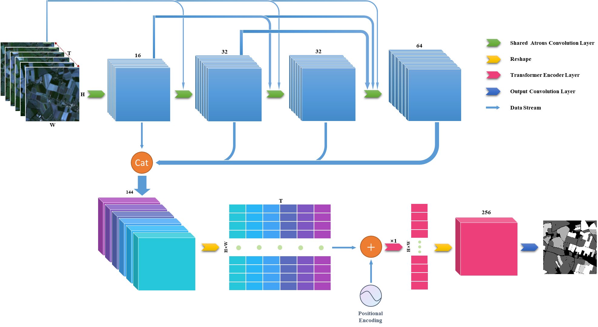
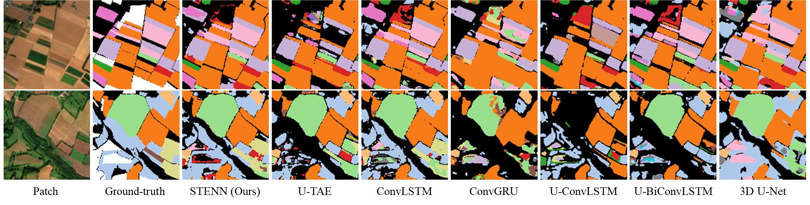

# A Spatio-temporal Encoding Neural Network for Semantic Segmentation of Satellite Image Time Series
PyTorch implementation of STENN for satellite image time series semantic segmentation.


## Abstract
Remote sensing image semantic segmentation plays a crucial role in various fields, such as environmental monitoring, urban planning, and agricultural land classification. However, most current research primarily focuses on utilizing the spatial and spectral information of single-temporal remote sensing images, neglecting the valuable temporal information present in historical image sequences. In fact, historical images often contain valuable phenological variations in land features, which exhibit diverse patterns and can significantly benefit semantic segmentation tasks. This paper introduces a semantic segmentation framework for satellite image time series (SITS) based on dilated convolution and Transformer Encoder. The framework includes spatial encoding and temporal encoding. Spatial encoding, utilizing dilated convolutions exclusively, mitigates the loss of spatial accuracy and the need for upsampling, while allowing the extraction of rich multi-scale features through a combination of different dilation rates and dense connections. Temporal encoding leverages a Transformer Encoder to extract temporal features for each pixel in the image. To better capture the annual periodic patterns of phenological phenomena in land features, position encoding is calculated based on the image's acquisition date within the year. To assess the performance of this framework, comparative and ablation experiments were conducted using the PASTIS dataset. The results indicate that this framework achieves competitive performance with lower network parameters and memory requirements, making it suitable for resource-constrained device scenarios.

## Requirement
To install requirements:

```setup
pip install -r requirements.txt
```

## Result

